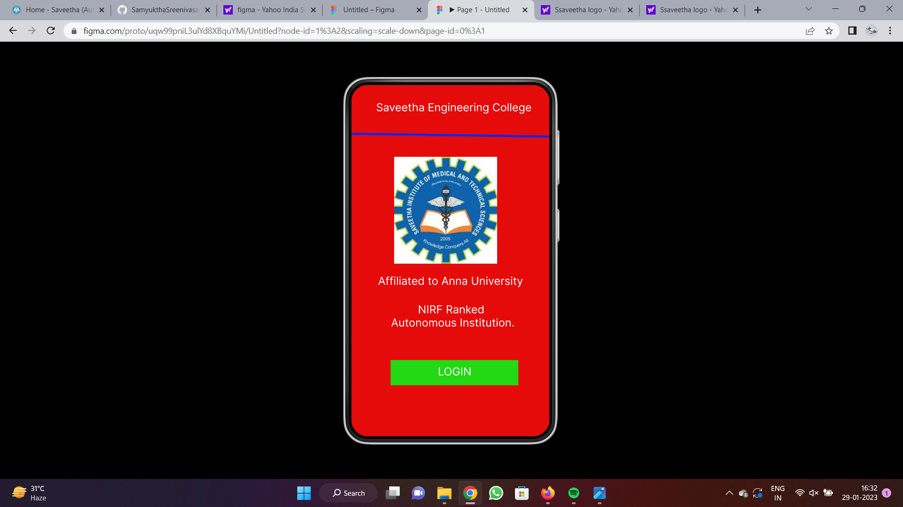
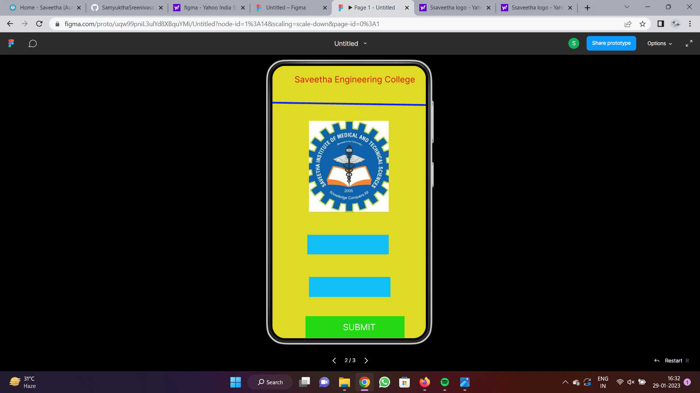
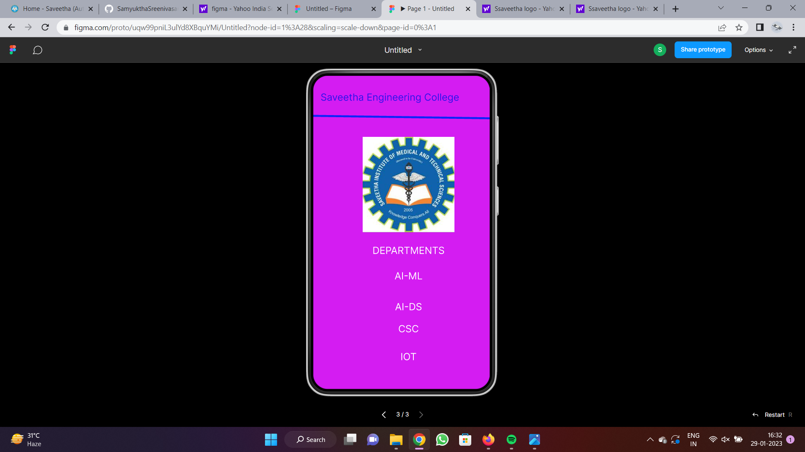

# Event Registration Web Application

## AIM:
To design, develop and deploy a web application for event registration.

## DESIGN STEPS:

### Step 1:
Create a new frame.

### Step 2:
Select any one preset size of your choice.

### Step 3:
Select the shapes you need.

### Step 4:
Import images as needed.

### Step 5:
Create pages based on your need and link them.

### Step 6:

Validate the HTML and CSS code.

### Step 6:

Publish the website in the given URL.

## DESIGN TOOL:
Figma
## CODE:
```
/* Home Page */

position: relative;
width: 360px;
height: 640px;
background: #E50B0B;

/* Login Page */

position: relative;
width: 360px;
height: 640px;
background: linear-gradient(0deg, rgba(224, 217, 30, 0.97), rgba(224, 217, 30, 0.97)), #FFFFFF;

/* Username */

position: absolute;
width: 313px;
height: 45px;
font-family: 'Inter';
font-style: normal;
font-weight: 400;
font-size: 20px;
line-height: 24px;
text-align: center;
color: #EC1616;

/* Password */

position: absolute;
width: 313px;
height: 45px;
font-family: 'Inter';
font-style: normal;
font-weight: 400;
font-size: 20px;
line-height: 24px;
text-align: center;
color: #EC1616;

/* SEC Page */

position: relative;
width: 360px;
height: 640px;
background: #D41CF2;
```
## OUTPUT:




## RESULT:
The program to design, develop and deploy a web application for event registration is completed successfully.